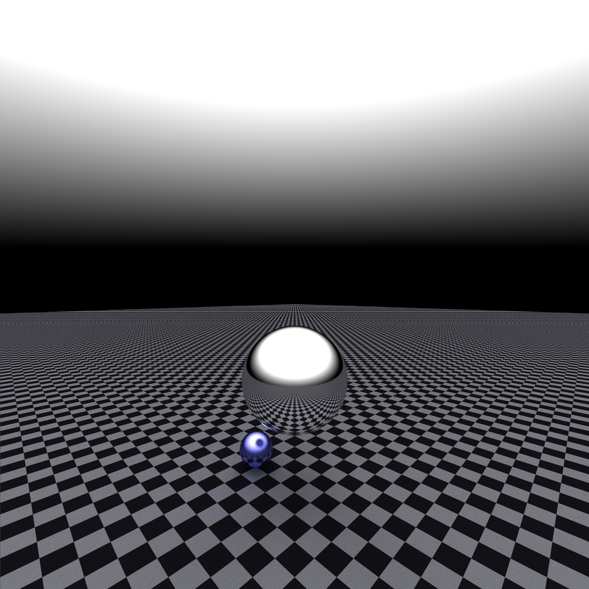

# Rust Path Tracer
A simple, and high performance path tracer written in Rust for learning about path tracing.,

# Features
- parallel rendering with rayon
- recursive ray traversal
- modular trait based ray vs geometry testing logic

# Running Locally

make sure you have rustc installed by checking with 
> rustc --version

1- Clone and cd into the repository with 
> git clone https://github.com/SarpAkin/rust_path_tracer && cd rust_path_tracer

2- Run the renderer with
> cargo run --release

3- Output
you should now see out.png in the root of the project

# Results
